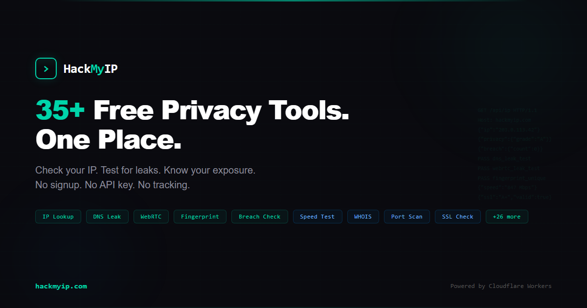
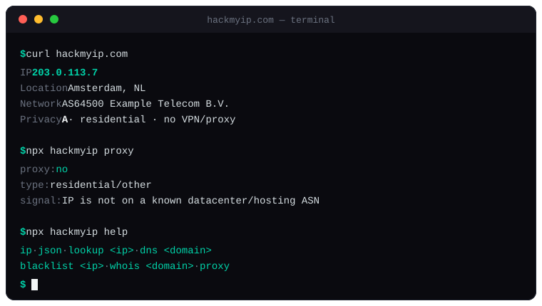

<p align="center">
  <a href="https://hackmyip.com?utm_source=github&utm_medium=readme&utm_content=intro">
    
  </a>
</p>

<h1 align="center">HackMyIP</h1>

<p align="center">
  <strong>50+ free privacy & network tools in one place. No signup. No API key.</strong>
</p>

<p align="center">
  
</p>

<p align="center">
  <a href="https://hackmyip.com?utm_source=github&utm_medium=readme&utm_content=intro">Website</a> ·
  <a href="https://hackmyip.com/api?utm_source=github&utm_medium=readme&utm_content=intro">API Docs</a> ·
  <a href="https://www.npmjs.com/package/hackmyip">npm</a>
</p>

<p align="center">
  <a href="https://www.npmjs.com/package/hackmyip"></a>
  <a href="https://www.npmjs.com/package/hackmyip"></a>
  <a href="https://github.com/hackmyip/hackmyip-js/actions/workflows/ci.yml"></a>
  <a href="https://hackmyip.com?utm_source=github&utm_medium=readme&utm_content=intro"></a>
  <a href="https://github.com/hackmyip/hackmyip-js/stargazers"></a>
  <a href="https://opensource.org/licenses/MIT"></a>
</p>

---

## What is HackMyIP?

[HackMyIP](https://hackmyip.com?utm_source=github&utm_medium=readme&utm_content=what-is-hackmyip) is a free, all-in-one privacy toolkit with 50+ tools for checking your IP, testing for leaks, and analyzing your online privacy. Everything runs on Cloudflare's edge network. No signup, no API key, no tracking.

One place instead of juggling HaveIBeenPwned + DNSLeakTest + BrowserLeaks + WhatIsMyIP + ipleak.net.

## Tools

### Privacy & Security
| Tool | Description | Link |
|------|-------------|------|
| IP Lookup | Your IP, location, ISP, and privacy grade | [Try it](https://hackmyip.com?utm_source=github&utm_medium=readme&utm_content=privacy-security) |
| Email Breach Checker | Check if your email was leaked in data breaches | [Try it](https://hackmyip.com/breach?utm_source=github&utm_medium=readme&utm_content=privacy-security) |
| Privacy Checkup | Full privacy audit with letter grade | [Try it](https://hackmyip.com/checkup?utm_source=github&utm_medium=readme&utm_content=privacy-security) |
| DNS Leak Test | Check if your DNS queries are leaking | [Try it](https://hackmyip.com/dns-leak?utm_source=github&utm_medium=readme&utm_content=privacy-security) |
| WebRTC Leak Test | Check if WebRTC is exposing your real IP | [Try it](https://hackmyip.com/webrtc?utm_source=github&utm_medium=readme&utm_content=privacy-security) |
| Browser Fingerprint | See how unique and trackable your browser is | [Try it](https://hackmyip.com/fingerprint?utm_source=github&utm_medium=readme&utm_content=privacy-security) |
| Torrent Leak Test | Check if torrents expose your real IP | [Try it](https://hackmyip.com/torrent-leak?utm_source=github&utm_medium=readme&utm_content=privacy-security) |
| Proxy/VPN Detector | Detect if an IP is a proxy, VPN, or datacenter | [Try it](https://hackmyip.com/proxy?utm_source=github&utm_medium=readme&utm_content=privacy-security) |
| SSL/TLS Checker | Check a domain's SSL certificate and security | [Try it](https://hackmyip.com/ssl?utm_source=github&utm_medium=readme&utm_content=privacy-security) |
| Password Strength | Test how strong your password is | [Try it](https://hackmyip.com/password?utm_source=github&utm_medium=readme&utm_content=privacy-security) |
| Password Generator | Generate secure passwords | [Try it](https://hackmyip.com/generate?utm_source=github&utm_medium=readme&utm_content=privacy-security) |
| IP Blacklist Check | Check if an IP is on any blacklists | [Try it](https://hackmyip.com/blacklist?utm_source=github&utm_medium=readme&utm_content=privacy-security) |

### Network Tools
| Tool | Description | Link |
|------|-------------|------|
| Speed Test | Test your connection speed | [Try it](https://hackmyip.com/speed?utm_source=github&utm_medium=readme&utm_content=network-tools) |
| DNS Lookup | Query DNS records for any domain | [Try it](https://hackmyip.com/dns?utm_source=github&utm_medium=readme&utm_content=network-tools) |
| WHOIS Lookup | Domain and IP registration data | [Try it](https://hackmyip.com/whois?utm_source=github&utm_medium=readme&utm_content=network-tools) |
| Port Scanner | Check open ports on your connection | [Try it](https://hackmyip.com/ports?utm_source=github&utm_medium=readme&utm_content=network-tools) |
| Traceroute | Trace the path to any destination | [Try it](https://hackmyip.com/traceroute?utm_source=github&utm_medium=readme&utm_content=network-tools) |
| Reverse DNS | Find hostnames for any IP | [Try it](https://hackmyip.com/rdns?utm_source=github&utm_medium=readme&utm_content=network-tools) |
| Subnet Calculator | Calculate CIDR ranges and subnets | [Try it](https://hackmyip.com/subnet?utm_source=github&utm_medium=readme&utm_content=network-tools) |
| CIDR Calculator | IP range calculations | [Try it](https://hackmyip.com/cidr?utm_source=github&utm_medium=readme&utm_content=network-tools) |
| Bulk IP Lookup | Look up multiple IPs at once | [Try it](https://hackmyip.com/bulk-lookup?utm_source=github&utm_medium=readme&utm_content=network-tools) |
| Email Header Analyzer | Parse and analyze email headers | [Try it](https://hackmyip.com/email-headers?utm_source=github&utm_medium=readme&utm_content=network-tools) |
| Is It Down? | Check if a service is down right now | [Try it](https://hackmyip.com/down?utm_source=github&utm_medium=readme&utm_content=network-tools) |
| Headers Check | View your HTTP request headers | [Try it](https://hackmyip.com/headers?utm_source=github&utm_medium=readme&utm_content=network-tools) |

### Browser & Device Info
| Tool | Description | Link |
|------|-------------|------|
| Browser Info | Detailed browser capabilities | [Try it](https://hackmyip.com/browser?utm_source=github&utm_medium=readme&utm_content=browser-device-info) |
| Screen Info | Display resolution and device info | [Try it](https://hackmyip.com/screen?utm_source=github&utm_medium=readme&utm_content=browser-device-info) |
| User Agent Parser | Parse and decode user agent strings | [Try it](https://hackmyip.com/user-agent?utm_source=github&utm_medium=readme&utm_content=browser-device-info) |
| Timezone Test | Detect timezone discrepancies | [Try it](https://hackmyip.com/timezone-test?utm_source=github&utm_medium=readme&utm_content=browser-device-info) |
| Language Detection | Browser language settings | [Try it](https://hackmyip.com/language?utm_source=github&utm_medium=readme&utm_content=browser-device-info) |
| Location Test | Geolocation API test | [Try it](https://hackmyip.com/location?utm_source=github&utm_medium=readme&utm_content=browser-device-info) |

### Developer Utilities
| Tool | Description | Link |
|------|-------------|------|
| Base64 Encode/Decode | Base64 converter | [Try it](https://hackmyip.com/base64?utm_source=github&utm_medium=readme&utm_content=developer-utilities) |
| JSON Formatter | Pretty-print and validate JSON | [Try it](https://hackmyip.com/json?utm_source=github&utm_medium=readme&utm_content=developer-utilities) |
| Hash Generator | MD5, SHA-1, SHA-256 hashing | [Try it](https://hackmyip.com/hash?utm_source=github&utm_medium=readme&utm_content=developer-utilities) |
| URL Encoder | URL encode/decode | [Try it](https://hackmyip.com/url-encode?utm_source=github&utm_medium=readme&utm_content=developer-utilities) |
| QR Code Generator | Generate QR codes | [Try it](https://hackmyip.com/qr?utm_source=github&utm_medium=readme&utm_content=developer-utilities) |

### IP by Country
Browse IP infrastructure for [190+ countries](https://hackmyip.com/ip?utm_source=github&utm_medium=readme&utm_content=ip-by-country) with privacy scores, ISP data, and city-level pages.

## Use it from your terminal (curl)

Every core lookup is curl-able. No signup, no API key. The site serves clean text/JSON to CLI user-agents and the full site to browsers:

```bash
curl hackmyip.com            # your IP + location + network
curl hackmyip.com/ip         # raw IP only — pipe-friendly: IP=$(curl -s hackmyip.com/ip)
curl hackmyip.com/json       # IP + city + country + ASN + org (JSON)
curl hackmyip.com/headers    # your request headers
curl hackmyip.com/ua         # your User-Agent
curl hackmyip.com/asn        # your ASN + ISP
curl hackmyip.com/proxy      # VPN / proxy / datacenter verdict
curl hackmyip.com/rdns       # reverse DNS (PTR) of your IP
curl hackmyip.com/help       # full command list
```

Full command reference: [hackmyip.com/cli](https://hackmyip.com/cli?utm_source=github&utm_medium=readme&utm_content=use-it-from-your-terminal-cu)

## CLI (`npx hackmyip`)

Prefer Node over curl? The same toolkit ships as a zero-config CLI. No install, no key — just run it:

```bash
npx hackmyip                  # your IP + location + network (summary)
npx hackmyip ip               # your public IP only (raw, pipe-friendly)
npx hackmyip json             # full JSON (IP + city + country + asn + org)
npx hackmyip proxy            # VPN / proxy / datacenter verdict for your IP
npx hackmyip lookup 8.8.8.8   # geolocation + network for any IP
npx hackmyip dns github.com MX  # DNS records (A, AAAA, MX, NS, TXT, ...)
npx hackmyip blacklist 8.8.8.8  # DNSBL reputation across major blocklists
npx hackmyip whois example.com  # WHOIS / RDAP registration data
npx hackmyip help             # full command list
```

Example:

```text
$ npx hackmyip
IP        203.0.113.7
Location  Amsterdam, NL
Network   AS64500  Example Telecom B.V.
```

Dependency-free, Node 18+, colorized output on a TTY (auto-plain when piped or `NO_COLOR` is set). It calls the same public `hackmyip.com` API the npm client uses.

## API

Free API with no key required. Use directly or via the npm client.

### Install

```bash
npm install hackmyip
```

### Quick Start (ESM)

```javascript
import hackmyip from 'hackmyip';

// Get your IP + location + privacy grade
const me = await hackmyip.getMyIP();
console.log(me.ip);              // "203.0.113.42"
console.log(me.privacy.grade);   // "A"

// Look up any IP
const data = await hackmyip.lookup("8.8.8.8");
console.log(data.location.city); // "Ashburn"

// Check email breaches
const breach = await hackmyip.checkBreach("user@example.com");
console.log(breach.breaches);    // 13
console.log(breach.risk.level);  // "high"

// DNS records for a domain
const dns = await hackmyip.dnsLookup("github.com", "MX");
console.log(dns.records);         // [{ name, type, TTL, data }, ...]

// WHOIS / RDAP registration data
const who = await hackmyip.whois("example.com");
console.log(who.registrar, who.expiration_date);

// Is a site up or down?
const site = await hackmyip.checkSite("example.com");
console.log(site.is_up, site.response_time_ms);
```

### Quick Start (CommonJS)

```javascript
const { getMyIP, lookup, dnsLookup, checkBlacklist } = require('hackmyip');

const me = await getMyIP();
console.log(me.ip, me.privacy.grade);

const bl = await checkBlacklist("203.0.113.42");
console.log(bl.status);          // "CLEAN" | "WARNING" | "BLACKLISTED"
```

### Methods

| Method | Endpoint | Description |
|--------|----------|-------------|
| `getMyIP()` | `GET /api/ip` | Your IP + geolocation + privacy score |
| `lookup(ip)` | `GET /api/lookup` | Geolocation + network for any IP |
| `getPrivacyScore()` | `GET /api/score` | IP cleanliness + VPN/datacenter detection |
| `checkBreach(email)` | `GET /api/breach` | Email breach check + password exposure |
| `dnsLookup(domain, type?)` | `GET /api/dns` | DNS records (A, AAAA, MX, NS, TXT, …) |
| `whois(domain)` | `GET /api/whois` | WHOIS / RDAP registration data |
| `reverseDns(ip)` | `GET /api/rdns` | Reverse DNS (PTR) hostname |
| `checkBlacklist(ip)` | `GET /api/blacklist` | DNSBL reputation across 12 blocklists |
| `checkSite(url)` | `GET /api/down` | Is a site up or down + response time |
| `bulkLookup(ips)` | `POST /api/bulk` | Look up up to 50 IPs at once |

Every method returns the `data` payload directly and throws an `Error` on failure. Full docs: [hackmyip.com/api](https://hackmyip.com/api?utm_source=github&utm_medium=readme&utm_content=methods)

> The npm client covers the JSON API tools. Browser-based tools on the site (WebRTC/DNS leak tests, browser fingerprint, speed test) require a real browser and aren't part of the Node client.

### Badge

Using the API or this client in your project? Add the badge so your users know where the IP data comes from:

[](https://hackmyip.com/api?utm_source=github&utm_medium=readme&utm_content=badge)

```markdown
[](https://hackmyip.com/api)
```

## Why HackMyIP?

- **50+ tools** in one place (vs 1-2 per competitor)
- **No signup, no API key** for anything
- **Fast** — runs on Cloudflare's global edge network
- **Privacy-first** — built to minimize data retention, runs on Cloudflare's edge with no persistent logging
- **Multi-language** — English, 简体中文, 繁體中文
- **Free** — no premium tier, no usage limits

## Alternatives

| Tool | Tools | Free | No Signup | Edge Speed | API |
|------|-------|------|-----------|------------|-----|
| **HackMyIP** | **50+** | **Yes** | **Yes** | **Yes (CF)** | **Yes** |
| ipleak.net | 5 | Yes | Yes | No | No |
| browserleaks.com | 8 | Yes | Yes | No | No |
| whatismyipaddress.com | 3 | Yes | Yes | No | No |
| jason5ng32/MyIP | 15 | Yes | Yes | No | No |

## Contributing

Found a bug? Want a new tool? [Open an issue](https://github.com/hackmyip/hackmyip-js/issues).

## License

MIT

---

<p align="center">
  <a href="https://hackmyip.com?utm_source=github&utm_medium=readme&utm_content=license"><strong>hackmyip.com</strong></a> — Free privacy toolkit. Check your IP. Test for leaks. Know your exposure.
</p>
